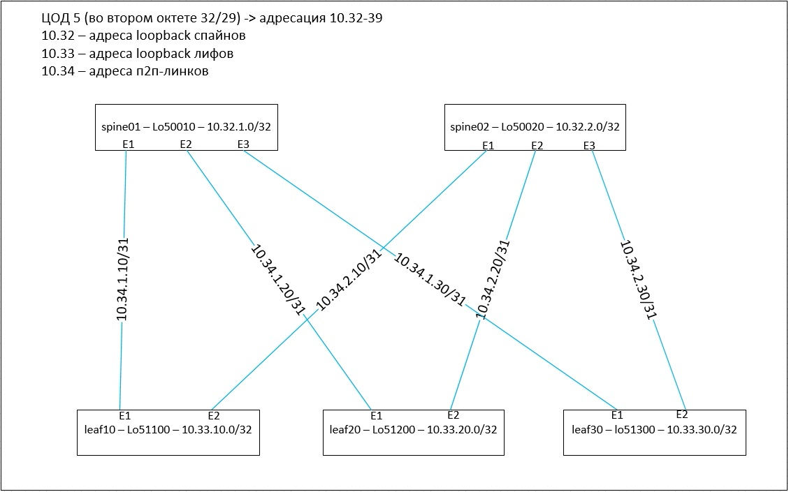

План выполнения д/з к занятию №3 -  Основы проектирования сети:
I.		придумываем логику распределения адресного пространства
II.		рисуем схему
III.	расписываем адресацию на картинке и в табличном виде
IV.		пишем команды конфигурации устройств

I.		придумываем логику распределения адресного пространства

- первый октет - 10
- второй октет - режем по /29 на каждый ЦОД, т.е. для нашего 5-го ЦОДа во втором октете используем числа с 32 по 39, а именно:
32 - для адресов loopback-ов spine-ов
33 - для адресов loopback-ов leaf-ов
34 - для адресов p2p-link-ов
35-39 - резерв
- третий октет - номер spine-а или номер leaf-а в адресах loopback-ов, номер spine-а в адресах p2p-ов
- четвертый октет - в случае loopback-а - номер loopback-а на устройстве, в случае p2p - (номер leaf-а)*10
- именование loopback-ов:
1-я цифра - номер ЦОДа (закладываемся что их не более 9)
2-я цифра - 0 у spine-ов и 1 у leaf-ов
3 и 4 цифры - номер spine-а или leaf-а (leaf-ы нумеруются десятками - 10й,20й,30й, ...)
5-я цифра - номер loopback-а на устройстве (т.е. 0-9 - закладываемся что их не больше 10шт)

примеры:
4-й ЦОД - второй октет - 24/29
3-й spine, 1-й loopback - interface Loopback40031 ip 10.24.3.1/32
17-й leaf, 2-й loopback - interface Loopback41172 ip 10.25.170.2/32
p2p между 5-м spine и 19-м leaf - 10.26.5.190/31 (четный - 190 - spine, нечетный - 191 - leaf)

 

