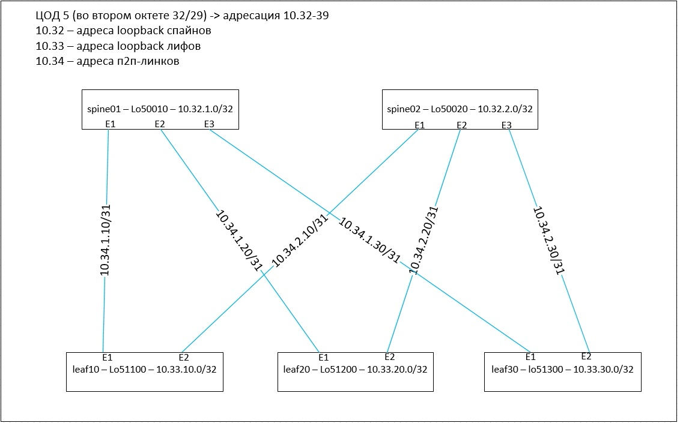

## План работы
- конфигурим девайсы в соответствии с картинкой из первой лабы
- проверяем доступность между loopback-ами

 

## конфигурация spine01

interface Ethernet1

   no switchport
   
   ip address 10.34.1.10/31
   
   ip ospf network point-to-point
   
   ip ospf area 0.0.0.0
   
!

interface Ethernet2

   no switchport
   
   ip address 10.34.1.20/31
   
   ip ospf network point-to-point
   
   ip ospf area 0.0.0.0
   
!

interface Ethernet3

   no switchport
   
   ip address 10.34.1.30/31
   
   ip ospf network point-to-point
   
   ip ospf area 0.0.0.0
   
!

interface Loopback1

   ip address 10.32.1.0/32
   
   ip ospf area 0.0.0.0
   
!

ip routing

!

router ospf 5

   passive-interface default
   
   no passive-interface Ethernet1
   
   no passive-interface Ethernet2
   
   no passive-interface Ethernet3
   
## конфигурация spine02

interface Ethernet1

   no switchport
   
   ip address 10.34.2.10/31
   
   ip ospf network point-to-point
   
   ip ospf area 0.0.0.0
   
!

interface Ethernet2

   no switchport
   
   ip address 10.34.2.20/31
   
   ip ospf network point-to-point
   
   ip ospf area 0.0.0.0
   
!

interface Ethernet3

   no switchport
   
   ip address 10.34.2.30/31
   
   ip ospf network point-to-point
   
   ip ospf area 0.0.0.0
   
!

interface Loopback2

   ip address 10.32.2.0/32
   
   ip ospf area 0.0.0.0
   
!

ip routing

!

router ospf 5

   passive-interface default
   
   no passive-interface Ethernet1
   
   no passive-interface Ethernet2
   
   no passive-interface Ethernet3

   ## конфигурация leaf10

   interface Ethernet1
   
   no switchport
   
   ip address 10.34.1.11/31
   
   ip ospf network point-to-point
   
   ip ospf area 0.0.0.0
   
!

interface Ethernet2

   no switchport
   
   ip address 10.34.2.11/31
   
   ip ospf network point-to-point
   
   ip ospf area 0.0.0.0
   
!

interface Loopback10

   ip address 10.33.10.0/32
   
   ip ospf area 0.0.0.0
   
ip routing

!

router ospf 5

   passive-interface default
   
   no passive-interface Ethernet1
   
   no passive-interface Ethernet2

   
   
