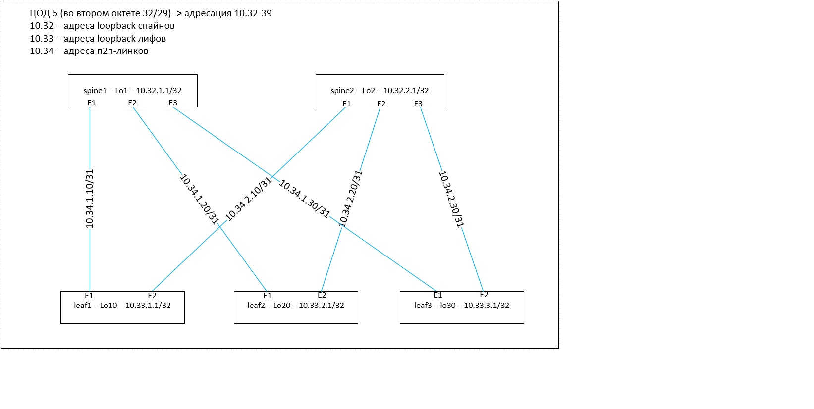

## План работы
- конфигурим девайсы в соответствии с картинкой из первой лабы
- проверяем доступность между loopback-ами

 

## конфигурация spine01

   
## конфигурация spine02

## конфигурация leaf10

## конфигурация leaf20

   
## конфигурация leaf30

   
## проверяем ip-связность между loopback-ами leaf-ов:

### leaf10#ping 10.33.20.0 source Loopback10

PING 10.33.20.0 (10.33.20.0) from 10.33.10.0 : 72(100) bytes of data.

80 bytes from 10.33.20.0: icmp_seq=1 ttl=63 time=16.7 ms

80 bytes from 10.33.20.0: icmp_seq=2 ttl=63 time=6.78 ms

80 bytes from 10.33.20.0: icmp_seq=3 ttl=63 time=7.74 ms

80 bytes from 10.33.20.0: icmp_seq=4 ttl=63 time=7.39 ms

80 bytes from 10.33.20.0: icmp_seq=5 ttl=63 time=8.48 ms

--- 10.33.20.0 ping statistics ---

5 packets transmitted, 5 received, 0% packet loss, time 55ms

rtt min/avg/max/mdev = 6.786/9.426/16.723/3.690 ms, pipe 2, ipg/ewma 13.847/12.981 ms

### leaf10#ping 10.33.30.0 source Loopback10

PING 10.33.30.0 (10.33.30.0) from 10.33.10.0 : 72(100) bytes of data.

80 bytes from 10.33.30.0: icmp_seq=1 ttl=63 time=11.4 ms

80 bytes from 10.33.30.0: icmp_seq=2 ttl=63 time=8.39 ms

80 bytes from 10.33.30.0: icmp_seq=3 ttl=63 time=7.01 ms

80 bytes from 10.33.30.0: icmp_seq=4 ttl=63 time=7.06 ms

80 bytes from 10.33.30.0: icmp_seq=5 ttl=63 time=6.74 ms

--- 10.33.30.0 ping statistics ---

5 packets transmitted, 5 received, 0% packet loss, time 43ms

rtt min/avg/max/mdev = 6.746/8.135/11.460/1.759 ms, ipg/ewma 10.917/9.707 ms

