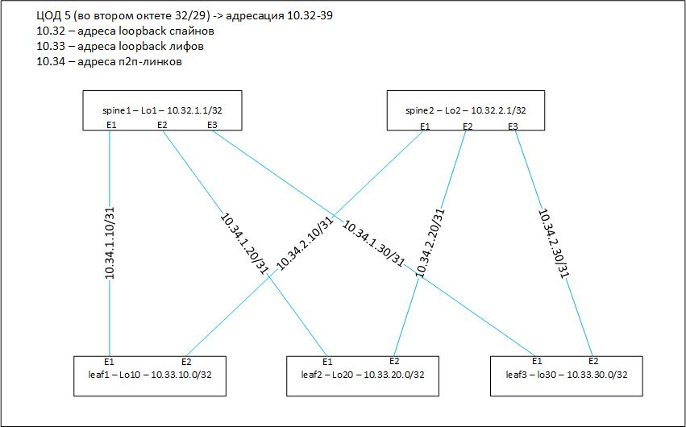

#         eBGP в качестве underlay

Делаем eBGP. В качестве номеров АС берес 65500 для spine-ов, 65010 65020 65030 для leaf-ов 10 20 и 30 соответственно

## План работы
- конфигурим девайсы в соответствии с картинкой из первой лабы
- проверяем доступность между loopback-ами


<p align="center">
 
</p>

## конфигурация spine01
```
interface Ethernet1
   no switchport
   ip address 10.34.1.10/31
!
interface Ethernet2
   no switchport
   ip address 10.34.1.20/31
!
interface Ethernet3
   no switchport
   ip address 10.34.1.30/31
!
interface Loopback1
   ip address 10.32.1.0/32
!
ip routing
!
peer-filter LEAVES-ASNs
   10 match as-range 65010-65030 result accept
!
router bgp 65000
   router-id 10.32.1.0
   bgp listen range 10.34.0.0/16 peer-group LEAVES peer-filter LEAVES-ASNs
   neighbor LEAVES peer group
   neighbor LEAVES bfd
```
   
## конфигурация spine02
```
interface Ethernet1
   no switchport
   ip address 10.34.2.10/31
!
interface Ethernet2
   no switchport
   ip address 10.34.2.20/31
!
interface Ethernet3
   no switchport
   ip address 10.34.2.30/31
!
interface Loopback2
   ip address 10.32.2.0/32
!
ip routing
!
peer-filter LEAVES-ASNs
   10 match as-range 65010-65030 result accept
!
router bgp 65000
   router-id 10.32.2.0
   bgp listen range 10.34.0.0/16 peer-group LEAVES peer-filter LEAVES-ASNs
   neighbor LEAVES peer group
   neighbor LEAVES bfd
```

## конфигурация leaf10
```
interface Ethernet1
   no switchport
   ip address 10.34.1.11/31
!
interface Ethernet2
   no switchport
   ip address 10.34.2.11/31
!
interface Loopback10
   ip address 10.33.10.0/32
!
ip routing
!
router bgp 65010
   router-id 10.33.10.0
   maximum-paths 2
   neighbor SPINES peer group
   neighbor SPINES remote-as 65000
   neighbor SPINES bfd
   neighbor 10.34.1.10 peer group SPINES
   neighbor 10.34.2.10 peer group SPINES
   network 10.33.10.0/32
```

## конфигурация leaf20
```
interface Ethernet1
   no switchport
   ip address 10.34.1.21/31
!
interface Ethernet2
   no switchport
   ip address 10.34.2.21/31
!
interface Loopback20
   ip address 10.33.20.0/32
!
ip routing
!
router bgp 65020
   router-id 10.33.20.0
   maximum-paths 2
   neighbor SPINES peer group
   neighbor SPINES remote-as 65000
   neighbor SPINES bfd
   neighbor 10.34.1.20 peer group SPINES
   neighbor 10.34.2.20 peer group SPINES
   network 10.33.20.0/32
```

## конфигурация leaf30
```
interface Ethernet1
   no switchport
   ip address 10.34.1.31/31
!
interface Ethernet2
   no switchport
   ip address 10.34.2.31/31
!
interface Loopback30
   ip address 10.33.30.0/32
!
ip routing
!
router bgp 65030
   router-id 10.33.30.0
   maximum-paths 2
   neighbor SPINES peer group
   neighbor SPINES remote-as 65000
   neighbor SPINES bfd
   neighbor 10.34.1.30 peer group SPINES
   neighbor 10.34.2.30 peer group SPINES
   network 10.33.30.0/32
```
## проверяем разное
### проверяем статусы bgp соседства
```
spine01#sh ip bgp su
Router identifier 10.32.1.0, local AS number 65000
Neighbor Status Codes: m - Under maintenance
  Neighbor         V  AS           MsgRcvd   MsgSent  InQ OutQ  Up/Down State   PfxRcd PfxAcc
  10.34.1.11       4  65010             49        50    0    0 00:44:36 Estab   1      1
  10.34.1.21       4  65020             49        50    0    0 00:44:36 Estab   1      1
  10.34.1.31       4  65030             34        35    0    0 00:29:06 Estab   1      1
```

### проверяем статусы bfd соседства
```
spine02#show bfd peers
VRF name: default
-----------------
DstAddr        MyDisc    YourDisc  Interface/Transport    Type          LastUp 
---------- ----------- ----------- -------------------- ------- ---------------
10.34.2.11 3909103371  2165189215        Ethernet1(11)  normal  12/02/24 00:44 
10.34.2.21 3643785541   360989875        Ethernet2(12)  normal  12/02/24 00:44 
10.34.2.31 3003998637  3562754630        Ethernet3(13)  normal  12/02/24 00:55 

   LastDown            LastDiag    State
-------------- ------------------- -----
         NA       No Diagnostic       Up
         NA       No Diagnostic       Up
         NA       No Diagnostic       Up

```
### смотрим на таблицы маршрутов bgp, видим что маршрутов до других leaf-ов по 2 штуки
```
leaf10#sh ip bgp
BGP routing table information for VRF default
Router identifier 10.33.10.0, local AS number 65010
Route status codes: * - valid, > - active, # - not installed, E - ECMP head, e - ECMP
                    S - Stale, c - Contributing to ECMP, b - backup, L - labeled-unicast
Origin codes: i - IGP, e - EGP, ? - incomplete
AS Path Attributes: Or-ID - Originator ID, C-LST - Cluster List, LL Nexthop - Link Local Nexthop

         Network                Next Hop            Metric  LocPref Weight  Path
 * >     10.33.10.0/32          -                     0       0       -       i
 * >Ec   10.33.20.0/32          10.34.1.10            0       100     0       65000 65020 i
 *  ec   10.33.20.0/32          10.34.2.10            0       100     0       65000 65020 i
 * >Ec   10.33.30.0/32          10.34.1.10            0       100     0       65000 65030 i
 *  ec   10.33.30.0/32          10.34.2.10            0       100     0       65000 65030 i
```
### смотрим на GRT, видим по 2 равноценных маршрута до других leaf-ов
```
leaf20#sh ip ro
       B I - iBGP, B E - eBGP, R - RIP, I L1 - IS-IS level 1,

 B E      10.33.10.0/32 [200/0] via 10.34.1.20, Ethernet1
                                via 10.34.2.20, Ethernet2
 C        10.33.20.0/32 is directly connected, Loopback20
 B E      10.33.30.0/32 [200/0] via 10.34.1.20, Ethernet1
                                via 10.34.2.20, Ethernet2
 C        10.34.1.20/31 is directly connected, Ethernet1
 C        10.34.2.20/31 is directly connected, Ethernet2
```
### проверяем ip-связность между loopback-ами leaf-ов:
```
leaf10#ping 10.33.20.0 source Loopback10
PING 10.33.20.0 (10.33.20.0) from 10.33.10.0 : 72(100) bytes of data.
80 bytes from 10.33.20.0: icmp_seq=1 ttl=63 time=12.5 ms
80 bytes from 10.33.20.0: icmp_seq=2 ttl=63 time=7.34 ms
80 bytes from 10.33.20.0: icmp_seq=3 ttl=63 time=6.80 ms
80 bytes from 10.33.20.0: icmp_seq=4 ttl=63 time=6.69 ms
80 bytes from 10.33.20.0: icmp_seq=5 ttl=63 time=8.82 ms

--- 10.33.20.0 ping statistics ---
5 packets transmitted, 5 received, 0% packet loss, time 47ms
rtt min/avg/max/mdev = 6.694/8.442/12.553/2.193 ms, ipg/ewma 11.813/10.459 ms
```
