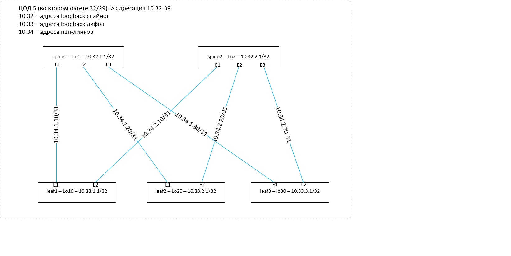

#         eBGP в качестве underlay

Делаем eBGP. В качестве номеров АС берес 65500 для spine-ов, 65010 65020 65030 для leaf-ов 10 20 и 30 соответственно

## План работы
- конфигурим девайсы в соответствии с картинкой из первой лабы
- проверяем доступность между loopback-ами


<p align="center">
 
</p>

## конфигурация spine01
```
interface Ethernet1
   no switchport
   ip address 10.34.1.10/31
   isis enable POD5
   isis bfd
!
interface Ethernet2
   no switchport
   ip address 10.34.1.20/31
   isis enable POD5
   isis bfd
!
interface Ethernet3
   no switchport
   ip address 10.34.1.30/31
   isis enable POD5
   isis bfd
!
interface Loopback1
   ip address 10.32.1.0/32
   isis enable POD5
!
ip routing
!
router isis POD5
   net 49.0011.0001.0001.0001.00
   is-type level-1
   !
   address-family ipv4 unicast
```
   
## конфигурация spine02
```
interface Ethernet1
   no switchport
   ip address 10.34.2.10/31
   isis enable POD5
   isis bfd
!
interface Ethernet2
   no switchport
   ip address 10.34.2.20/31
   isis enable POD5
   isis bfd
!
interface Ethernet3
   no switchport
   ip address 10.34.2.30/31
   isis enable POD5
   isis bfd
!
interface Loopback2
   ip address 10.32.2.0/32
   isis enable POD5
!
ip routing
!
router isis POD5
   net 49.0011.0001.0001.0002.00
   is-type level-1
   !
   address-family ipv4 unicast
```

## конфигурация leaf10
```
interface Ethernet1
   no switchport
   ip address 10.34.1.11/31
   isis enable POD5
   isis bfd
!
interface Ethernet2
   no switchport
   ip address 10.34.2.11/31
   isis enable POD5
   isis bfd
!
interface Loopback10
   ip address 10.33.10.0/32
   isis enable POD5
!
ip routing
!
router isis POD5
   net 49.0011.0001.0001.0010.00
   is-type level-1
   !
   address-family ipv4 unicast
```

## конфигурация leaf20
```
interface Ethernet1
   no switchport
   ip address 10.34.1.21/31
   isis enable POD5
   isis bfd
!
interface Ethernet2
   no switchport
   ip address 10.34.2.21/31
   isis enable POD5
   isis bfd
!
interface Loopback20
   ip address 10.33.20.0/32
   isis enable POD5
!
ip routing
!
router isis POD5
   net 49.0011.0001.0001.0020.00
   is-type level-1
   !
   address-family ipv4 unicast
```

## конфигурация leaf30
```
interface Ethernet1
   no switchport
   ip address 10.34.1.31/31
   isis enable POD5
   isis bfd
!
interface Ethernet2
   no switchport
   ip address 10.34.2.31/31
   isis enable POD5
   isis bfd
!
interface Loopback30
   ip address 10.33.30.0/32
   isis enable POD5
!
ip routing
!
router isis POD5
   net 49.0011.0001.0001.0030.00
   is-type level-1
   !
   address-family ipv4 unicast
```
## проверяем разное
### проверяем статусы isis соседства
```
spine01#show isis neighbors 
 
Instance  VRF      System Id        Type Interface          SNPA              State Hold time   Circuit Id          
POD5      default  leaf10           L1   Ethernet1          50:0:0:d7:ee:b    UP    7           leaf10.0b           
POD5      default  leaf20           L1   Ethernet2          50:0:0:d5:5d:c0   UP    8           leaf20.0b           
POD5      default  leaf30           L1   Ethernet3          50:0:0:f6:ad:37   UP    7           leaf30.0b
```

### проверяем статусы bfd соседства
```
spine01#show bfd peers 
VRF name: default
-----------------
DstAddr        MyDisc    YourDisc  Interface/Transport    Type          LastUp 
---------- ----------- ----------- -------------------- ------- ---------------
10.34.1.11 3096499086  1531209707        Ethernet1(11)  normal  11/27/24 21:22 
10.34.1.21  730431310   417995450        Ethernet2(12)  normal  11/27/24 21:34 
10.34.1.31 2579755259   578037804        Ethernet3(13)  normal  11/27/24 21:38 

   LastDown            LastDiag    State
-------------- ------------------- -----
         NA       No Diagnostic       Up
         NA       No Diagnostic       Up
         NA       No Diagnostic       Up
```
### смотрим на таблицы маршрутов
```
leaf10#show ip route isis 
 I L1     10.32.1.0/32 [115/20] via 10.34.1.10, Ethernet1
 I L1     10.32.2.0/32 [115/20] via 10.34.2.10, Ethernet2
 I L1     10.33.20.0/32 [115/30] via 10.34.1.10, Ethernet1
                                 via 10.34.2.10, Ethernet2
 I L1     10.33.30.0/32 [115/30] via 10.34.1.10, Ethernet1
                                 via 10.34.2.10, Ethernet2
 I L1     10.34.1.20/31 [115/20] via 10.34.1.10, Ethernet1
 I L1     10.34.1.30/31 [115/20] via 10.34.1.10, Ethernet1
 I L1     10.34.2.20/31 [115/20] via 10.34.2.10, Ethernet2
 I L1     10.34.2.30/31 [115/20] via 10.34.2.10, Ethernet2
```

### проверяем ip-связность между loopback-ами leaf-ов:
```
leaf10#ping 10.33.20.0 source Loopback10
PING 10.33.20.0 (10.33.20.0) from 10.33.10.0 : 72(100) bytes of data.
80 bytes from 10.33.20.0: icmp_seq=1 ttl=63 time=12.5 ms
80 bytes from 10.33.20.0: icmp_seq=2 ttl=63 time=7.34 ms
80 bytes from 10.33.20.0: icmp_seq=3 ttl=63 time=6.80 ms
80 bytes from 10.33.20.0: icmp_seq=4 ttl=63 time=6.69 ms
80 bytes from 10.33.20.0: icmp_seq=5 ttl=63 time=8.82 ms

--- 10.33.20.0 ping statistics ---
5 packets transmitted, 5 received, 0% packet loss, time 47ms
rtt min/avg/max/mdev = 6.694/8.442/12.553/2.193 ms, ipg/ewma 11.813/10.459 ms
```
