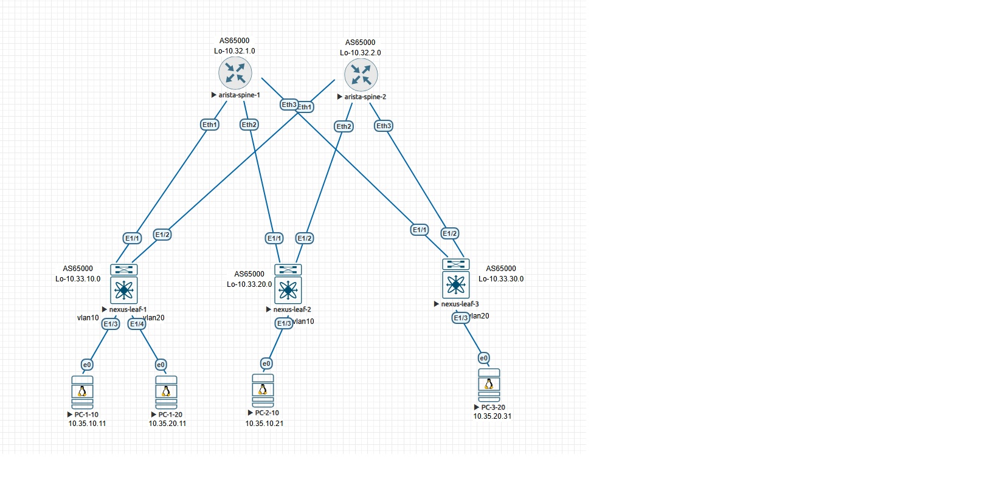

#         l2vpn evpn и ospf в качестве underlay

## План работы
- конфигурим девайсы в соответствии с картинкой (спайны аристы, лифы нексусы)
- проверяем доступность между loopback-ами - ospf underlay
- конфигурим все девайсы в одну bgp as (ibgp), спайны как роут-рефлекторы, на всех  девайсах делаем bgp address-family evpn, все отдают bgp extended community


<p align="center">
 
</p>

## конфигурация spine01
```
interface Ethernet1
   no switchport
   ip address 10.34.1.10/31
   ip ospf network point-to-point
   ip ospf area 0.0.0.0
!
interface Ethernet2
   no switchport
   ip address 10.34.1.20/31
   ip ospf network point-to-point
   ip ospf area 0.0.0.0
!
interface Ethernet3
   no switchport
   ip address 10.34.1.30/31
   ip ospf network point-to-point
   ip ospf area 0.0.0.0
!
interface Loopback1
   ip address 10.32.1.0/32
   ip ospf area 0.0.0.0

ip routing
!
router bgp 65000
   router-id 10.32.1.0
   bgp listen range 10.33.0.0/16 peer-group LEAVES remote-as 65000
   neighbor LEAVES peer group
   neighbor LEAVES remote-as 65000
   neighbor LEAVES update-source Loopback1
   neighbor LEAVES bfd
   neighbor LEAVES route-reflector-client
   neighbor LEAVES send-community extended
   !
   address-family evpn
      neighbor LEAVES activate
!
router ospf 65000
   max-lsa 12000
!
end
```
   
## конфигурация spine02
```
interface Ethernet1
   no switchport
   ip address 10.34.2.10/31
   ip ospf network point-to-point
   ip ospf area 0.0.0.0
!
interface Ethernet2
   no switchport
   ip address 10.34.2.20/31
   ip ospf network point-to-point
   ip ospf area 0.0.0.0
!
interface Ethernet3
   no switchport
   ip address 10.34.2.30/31
   ip ospf network point-to-point
   ip ospf area 0.0.0.0
!
interface Loopback1
   ip address 10.32.2.0/32
   ip ospf area 0.0.0.0
!
ip routing
!
router bgp 65000
   router-id 10.32.2.0
   bgp listen range 10.33.0.0/16 peer-group LEAVES remote-as 65000
   neighbor LEAVES peer group
   neighbor LEAVES remote-as 65000
   neighbor LEAVES update-source Loopback1
   neighbor LEAVES bfd
   neighbor LEAVES route-reflector-client
   neighbor LEAVES send-community extended
   !
   address-family evpn
      neighbor LEAVES activate
!
router ospf 65000
   max-lsa 12000
```

## конфигурация leaf10
```
hostname leaf-10
nv overlay evpn
feature ospf
feature bgp
feature fabric forwarding
feature vn-segment-vlan-based
feature bfd
feature nv overlay
vlan 1,10,20
vlan 10
  vn-segment 10
vlan 20
  vn-segment 20
interface nve1
  no shutdown
  host-reachability protocol bgp
  source-interface loopback0
  member vni 10
    ingress-replication protocol bgp
  member vni 20
    ingress-replication protocol bgp

interface Ethernet1/1
  no switchport
  ip address 10.34.1.11/31
  ip ospf network point-to-point
  ip router ospf 65000 area 0.0.0.0
  no shutdown

interface Ethernet1/2
  no switchport
  ip address 10.34.2.11/31
  ip ospf network point-to-point
  ip router ospf 65000 area 0.0.0.0
  no shutdown
interface Ethernet1/3
  switchport access vlan 10
interface Ethernet1/4
  switchport access vlan 20
interface loopback0
  ip address 10.33.10.0/32
  ip router ospf 65000 area 0.0.0.0

router ospf 65000
router bgp 65000
  address-family l2vpn evpn
  template peer SPINES
    remote-as 65000
    update-source loopback0
    address-family l2vpn evpn
      send-community
      send-community extended
  neighbor 10.32.1.0
    inherit peer SPINES
  neighbor 10.32.2.0
    inherit peer SPINES
```

## конфигурация leaf20
```
hostname leaf-20
nv overlay evpn
feature ospf
feature bgp
feature fabric forwarding
feature vn-segment-vlan-based
feature bfd
feature nv overlay
vlan 1,10
vlan 10
  vn-segment 10
interface nve1
  no shutdown
  host-reachability protocol bgp
  source-interface loopback0
  member vni 10
    ingress-replication protocol bgp

interface Ethernet1/1
  no switchport
  ip address 10.34.1.21/31
  ip ospf network point-to-point
  ip router ospf 65000 area 0.0.0.0
  no shutdown

interface Ethernet1/2
  no switchport
  ip address 10.34.2.21/31
  ip ospf network point-to-point
  ip router ospf 65000 area 0.0.0.0
  no shutdown
interface Ethernet1/3
  switchport access vlan 10
interface loopback0
  ip address 10.33.20.0/32
  ip router ospf 65000 area 0.0.0.0

router ospf 65000
router bgp 65000
  address-family l2vpn evpn
  template peer SPINES
    remote-as 65000
    update-source loopback0
    address-family l2vpn evpn
      send-community
      send-community extended
  neighbor 10.32.1.0
    inherit peer SPINES
  neighbor 10.32.2.0
    inherit peer SPINES
```

## конфигурация leaf30
```
hostname leaf-30
nv overlay evpn
feature ospf
feature bgp
feature fabric forwarding
feature vn-segment-vlan-based
feature bfd
feature nv overlay

vlan 1,20
vlan 20
  vn-segment 20
interface nve1
  no shutdown
  host-reachability protocol bgp
  source-interface loopback0
  member vni 20
    ingress-replication protocol bgp
interface nve1
  no shutdown
  host-reachability protocol bgp
  source-interface loopback0
  member vni 20
    ingress-replication protocol bgp

interface Ethernet1/1
  no switchport
  ip address 10.34.1.31/31
  ip ospf network point-to-point
  ip router ospf 65000 area 0.0.0.0
  no shutdown

interface Ethernet1/2
  no switchport
  ip address 10.34.2.31/31
  ip ospf network point-to-point
  ip router ospf 65000 area 0.0.0.0
  no shutdown

interface Ethernet1/3
  switchport access vlan 20
interface loopback0
  ip address 10.33.30.0/32
  ip router ospf 65000 area 0.0.0.0

router ospf 65000
router bgp 65000
  address-family l2vpn evpn
  template peer SPINES
    remote-as 65000
    update-source loopback0
    address-family l2vpn evpn
      send-community
      send-community extended
  neighbor 10.32.1.0
    inherit peer SPINES
  neighbor 10.32.2.0
    inherit peer SPINES
```
## проверяем разное
### проверяем что ospf underlay поднялся и есть связность между loopback-ами
```
leaf-10# sh ip ospf neighbors 
 OSPF Process ID 65000 VRF default
 Total number of neighbors: 2
 Neighbor ID     Pri State            Up Time  Address         Interface
 10.32.1.0         0 FULL/ -          01:42:50 10.34.1.10      Eth1/1 
 10.32.2.0         0 FULL/ -          01:42:51 10.34.2.10      Eth1/2

leaf-10# ping 10.33.30.0 source 10.33.10.0
PING 10.33.30.0 (10.33.30.0) from 10.33.10.0: 56 data bytes
64 bytes from 10.33.30.0: icmp_seq=0 ttl=253 time=4.388 ms
64 bytes from 10.33.30.0: icmp_seq=1 ttl=253 time=3.89 ms
64 bytes from 10.33.30.0: icmp_seq=2 ttl=253 time=3.616 ms
64 bytes from 10.33.30.0: icmp_seq=3 ttl=253 time=3.669 ms
64 bytes from 10.33.30.0: icmp_seq=4 ttl=253 time=3.584 ms

--- 10.33.30.0 ping statistics ---
5 packets transmitted, 5 packets received, 0.00% packet loss
round-trip min/avg/max = 3.584/3.829/4.388 ms

```
### bfd на этих нексусах не живет, смотреть бесполезно

### смотрим на состояние nve peers
```
leaf-10# sh nve peers 
Interface Peer-IP                                 State LearnType Uptime   Route
r-Mac       
--------- --------------------------------------  ----- --------- -------- -----
------------
nve1      10.33.20.0                              Up    CP        00:27:17 n/a  
            
nve1      10.33.30.0                              Up    CP        00:25:54 n/a
```
### смотрим разное
```
leaf-10# sh l2route evpn mac all 

Topology    Mac Address    Prod   Flags         Seq No     Next-Hops                              
----------- -------------- ------ ------------- ---------- ---------------------------------------
10          0050.0000.0600 Local  L,            0          Eth1/3                                 
10          0050.0000.0800 BGP    Rcv           0          10.33.20.0 (Label: 10)                 
20          0050.0000.0700 Local  L,            0          Eth1/4                                 
20          0050.0000.0900 BGP    Rcv           0          10.33.30.0 (Label: 20)

leaf-10# sh mac address-table 
---------+-----------------+--------+---------+------+----+------------------
*   10     0050.0000.0600   dynamic  0         F      F    Eth1/3
C   10     0050.0000.0800   dynamic  0         F      F    nve1(10.33.20.0)
*   20     0050.0000.0700   dynamic  0         F      F    Eth1/4
C   20     0050.0000.0900   dynamic  0         F      F    nve1(10.33.30.0)
G    -     5002.0000.1b08   static   -         F      F    sup-eth1(R)

leaf-10# sh bgp all 

   Network            Next Hop            Metric     LocPrf     Weight Path
Route Distinguisher: 10.33.10.0:32777    (L2VNI 10)
*>l[2]:[0]:[0]:[48]:[0050.0000.0600]:[0]:[0.0.0.0]/216
                      10.33.10.0                        100      32768 i
*>i[2]:[0]:[0]:[48]:[0050.0000.0800]:[0]:[0.0.0.0]/216
                      10.33.20.0                        100          0 i
*>l[3]:[0]:[32]:[10.33.10.0]/88
                      10.33.10.0                        100      32768 i
*>i[3]:[0]:[32]:[10.33.20.0]/88
                      10.33.20.0                        100          0 i

Route Distinguisher: 10.33.10.0:32787    (L2VNI 20)
*>l[2]:[0]:[0]:[48]:[0050.0000.0700]:[0]:[0.0.0.0]/216
                      10.33.10.0                        100      32768 i
*>i[2]:[0]:[0]:[48]:[0050.0000.0900]:[0]:[0.0.0.0]/216
                      10.33.30.0                        100          0 i
*>l[3]:[0]:[32]:[10.33.10.0]/88
                      10.33.10.0                        100      32768 i
*>i[3]:[0]:[32]:[10.33.30.0]/88
                      10.33.30.0                        100          0 i

Route Distinguisher: 10.33.20.0:32777
* i[2]:[0]:[0]:[48]:[0050.0000.0800]:[0]:[0.0.0.0]/216
                      10.33.20.0                        100          0 i
*>i                   10.33.20.0                        100          0 i
*>i[3]:[0]:[32]:[10.33.20.0]/88
                      10.33.20.0                        100          0 i
* i                   10.33.20.0                        100          0 i

Route Distinguisher: 10.33.30.0:32787
*>i[2]:[0]:[0]:[48]:[0050.0000.0900]:[0]:[0.0.0.0]/216
                      10.33.30.0                        100          0 i
* i                   10.33.30.0                        100          0 i
* i[3]:[0]:[32]:[10.33.30.0]/88
                      10.33.30.0                        100          0 i
*>i                   10.33.30.0                        100          0 i
          
```
### проверяем ip-связность между машинами:
```
gns3@PC-1-10:~$ ping 10.35.10.21
PING 10.35.10.21 (10.35.10.21): 56 data bytes
64 bytes from 10.35.10.21: seq=0 ttl=64 time=18.471 ms
64 bytes from 10.35.10.21: seq=1 ttl=64 time=5.023 ms

gns3@PC-1-20:~$ ping 10.35.20.31
PING 10.35.20.31 (10.35.20.31): 56 data bytes
64 bytes from 10.35.20.31: seq=0 ttl=64 time=7.893 ms
64 bytes from 10.35.20.31: seq=1 ttl=64 time=15.400 ms
```
Очень хочется еще повторить в вариантах underlay ibgp и ebgp, и лифами еше аристы сделать, но это позже, со временем тяжело

