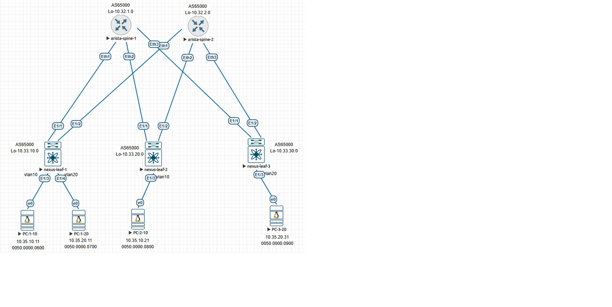

#         l3vpn evpn (ospf в качестве underlay)

## План работы
- берем готовую конфигурацию лифов и спайнов из предыдущей лабы по l2vpn
- добавляем нужное для l3vpn на лифах (конфигурация спайнов не меняется)
- проверяем

<p align="center">
 
</p>

## изиенения конфига лифов по сравнению с l2vpn:
```
1.feature interface-vlan - для создания SVI
2.fabric forwarding anycast-gateway-mac 1234.5678.0100 - одинаковый мак на всех лифах на всех SVI
3.hardware access-list tcam region racl 512 - освобождаем tcam под арп
4.hardware access-list tcam region arp-ether 256 double-wide - назначаем tcam под арп
тут нужна перезагрузка
5.создаем vrf под роутинг между vxlan
vrf context CUST-1
  vni 1000
  rd auto
  address-family ipv4 unicast
    route-target both auto
    route-target both auto evpn
6.создаем vlan, через который (ну т.е. через SVI который мы на нем потом сделаем) будут роутиться между собой все vxlan
vlan 1000
  vn-segment 1000
7.запихиваем 1000-й vni (т.е. ассоциированный с ним 1000-й vlan) в nve, а также запрещаем арп-бродкасты
interface nve1
  member vni 10
    suppress-arp
  member vni 20
    suppress-arp
  member vni 1000 associate-vrf
8.создаем SVI-ки с соответствующими ip-шниками (где-то оба, где-то по одному), помещаем их в наш vrf, ну и говорим anycast-gateway
interface Vlan10
  no shutdown
  vrf member CUST-1
  ip address 10.35.10.1/24
  fabric forwarding mode anycast-gateway
interface Vlan20
  no shutdown
  vrf member CUST-1
  ip address 10.35.20.1/24
  fabric forwarding mode anycast-gateway
9.создаем SVI, через который будут роутиться между собой все vxlan и помещаем его в тот же vrf, ip на нем не нужен
interface Vlan1000
  no shutdown
  vrf member CUST-1
  ip forward
```

## конфигурация arista-spine-1 (не изменилась)
```
interface Ethernet1
   no switchport
   ip address 10.34.1.10/31
   ip ospf network point-to-point
   ip ospf area 0.0.0.0
!
interface Ethernet2
   no switchport
   ip address 10.34.1.20/31
   ip ospf network point-to-point
   ip ospf area 0.0.0.0
!
interface Ethernet3
   no switchport
   ip address 10.34.1.30/31
   ip ospf network point-to-point
   ip ospf area 0.0.0.0
!
interface Loopback1
   ip address 10.32.1.0/32
   ip ospf area 0.0.0.0

ip routing
!
router bgp 65000
   router-id 10.32.1.0
   bgp listen range 10.33.0.0/16 peer-group LEAVES remote-as 65000
   neighbor LEAVES peer group
   neighbor LEAVES remote-as 65000
   neighbor LEAVES update-source Loopback1
   neighbor LEAVES bfd
   neighbor LEAVES route-reflector-client
   neighbor LEAVES send-community extended
   !
   address-family evpn
      neighbor LEAVES activate
!
router ospf 65000
   max-lsa 12000
!
end
```
   
## конфигурация arista-spine-2 (не изменилась)
```
interface Ethernet1
   no switchport
   ip address 10.34.2.10/31
   ip ospf network point-to-point
   ip ospf area 0.0.0.0
!
interface Ethernet2
   no switchport
   ip address 10.34.2.20/31
   ip ospf network point-to-point
   ip ospf area 0.0.0.0
!
interface Ethernet3
   no switchport
   ip address 10.34.2.30/31
   ip ospf network point-to-point
   ip ospf area 0.0.0.0
!
interface Loopback1
   ip address 10.32.2.0/32
   ip ospf area 0.0.0.0
!
ip routing
!
router bgp 65000
   router-id 10.32.2.0
   bgp listen range 10.33.0.0/16 peer-group LEAVES remote-as 65000
   neighbor LEAVES peer group
   neighbor LEAVES remote-as 65000
   neighbor LEAVES update-source Loopback1
   neighbor LEAVES bfd
   neighbor LEAVES route-reflector-client
   neighbor LEAVES send-community extended
   !
   address-family evpn
      neighbor LEAVES activate
!
router ospf 65000
   max-lsa 12000
```

## конфигурация nexus-leaf-1
```
hostname nexus-leaf-1
nv overlay evpn
feature ospf
feature bgp
feature fabric forwarding
feature interface-vlan
feature vn-segment-vlan-based
feature bfd
feature nv overlay

hardware access-list tcam region racl 512
hardware access-list tcam region arp-ether 256 double-wide

fabric forwarding anycast-gateway-mac 1234.5678.0100
vlan 1,10,20,1000
vlan 10
  vn-segment 10
vlan 20
  vn-segment 20
vlan 1000
  vn-segment 1000

vrf context CUST-1
  vni 1000
  rd auto
  address-family ipv4 unicast
    route-target both auto
    route-target both auto evpn
vrf context management

interface Vlan10
  no shutdown
  vrf member CUST-1
  ip address 10.35.10.1/24
  fabric forwarding mode anycast-gateway

interface Vlan20
  no shutdown
  vrf member CUST-1
  ip address 10.35.20.1/24
  fabric forwarding mode anycast-gateway

interface Vlan1000
  no shutdown
  vrf member CUST-1
  ip forward

interface nve1
  no shutdown
  host-reachability protocol bgp
  source-interface loopback0
  member vni 10
    suppress-arp
    ingress-replication protocol bgp
  member vni 20
    suppress-arp
    ingress-replication protocol bgp
  member vni 1000 associate-vrf

interface Ethernet1/1
  no switchport
  ip address 10.34.1.11/31
  ip ospf network point-to-point
  ip router ospf 65000 area 0.0.0.0
  no shutdown

interface Ethernet1/2
  no switchport
  ip address 10.34.2.11/31
  ip ospf network point-to-point
  ip router ospf 65000 area 0.0.0.0
  no shutdown
interface Ethernet1/3
  switchport access vlan 10
interface Ethernet1/4
  switchport access vlan 20
interface loopback0
  ip address 10.33.10.0/32
  ip router ospf 65000 area 0.0.0.0

router ospf 65000
router bgp 65000
  address-family l2vpn evpn
  template peer SPINES
    remote-as 65000
    update-source loopback0
    address-family l2vpn evpn
      send-community
      send-community extended
  neighbor 10.32.1.0
    inherit peer SPINES
  neighbor 10.32.2.0
    inherit peer SPINES
```

## конфигурация nexus-leaf-2
```
hostname nexus-leaf-2
nv overlay evpn
feature ospf
feature bgp
feature fabric forwarding
feature interface-vlan
feature vn-segment-vlan-based
feature bfd
feature nv overlay

hardware access-list tcam region racl 512
hardware access-list tcam region arp-ether 256 double-wide

fabric forwarding anycast-gateway-mac 1234.5678.0100
vlan 1,10,1000
vlan 10
  vn-segment 10
vlan 1000
  vn-segment 1000

vrf context CUST-1
  vni 1000
  rd auto
  address-family ipv4 unicast
    route-target both auto
    route-target both auto evpn
vrf context management

interface Vlan10
  no shutdown
  vrf member CUST-1
  ip address 10.35.10.1/24
  fabric forwarding mode anycast-gateway

interface Vlan1000
  no shutdown
  vrf member CUST-1
  ip forward

interface nve1
  no shutdown
  host-reachability protocol bgp
  source-interface loopback0
  member vni 10
    suppress-arp
    ingress-replication protocol bgp
  member vni 1000 associate-vrf


interface Ethernet1/1
  no switchport
  ip address 10.34.1.21/31
  ip ospf network point-to-point
  ip router ospf 65000 area 0.0.0.0
  no shutdown

interface Ethernet1/2
  no switchport
  ip address 10.34.2.21/31
  ip ospf network point-to-point
  ip router ospf 65000 area 0.0.0.0
  no shutdown
interface Ethernet1/3
  switchport access vlan 10
interface loopback0
  ip address 10.33.20.0/32
  ip router ospf 65000 area 0.0.0.0

router ospf 65000
router bgp 65000
  address-family l2vpn evpn
  template peer SPINES
    remote-as 65000
    update-source loopback0
    address-family l2vpn evpn
      send-community
      send-community extended
  neighbor 10.32.1.0
    inherit peer SPINES
  neighbor 10.32.2.0
    inherit peer SPINES
```

## конфигурация nexus-leaf-3
```
hostname nexus-leaf-3
nv overlay evpn
feature ospf
feature bgp
feature fabric forwarding
feature interface-vlan
feature vn-segment-vlan-based
feature bfd
feature nv overlay

hardware access-list tcam region racl 512
hardware access-list tcam region arp-ether 256 double-wide

fabric forwarding anycast-gateway-mac 1234.5678.0100
vlan 1,20,1000
vlan 20
  vn-segment 20
vlan 1000
  vn-segment 1000

vrf context CUST-1
  vni 1000
  rd auto
  address-family ipv4 unicast
    route-target both auto
    route-target both auto evpn
vrf context management

interface Vlan20
  no shutdown
  vrf member CUST-1
  ip address 10.35.20.1/24
  fabric forwarding mode anycast-gateway

interface Vlan1000
  no shutdown
  vrf member CUST-1
  ip forward

interface nve1
  no shutdown
  host-reachability protocol bgp
  source-interface loopback0
  member vni 20
    suppress-arp
    ingress-replication protocol bgp
  member vni 1000 associate-vrf

interface Ethernet1/1
  no switchport
  ip address 10.34.1.31/31
  ip ospf network point-to-point
  ip router ospf 65000 area 0.0.0.0
  no shutdown

interface Ethernet1/2
  no switchport
  ip address 10.34.2.31/31
  ip ospf network point-to-point
  ip router ospf 65000 area 0.0.0.0
  no shutdown

interface Ethernet1/3
  switchport access vlan 20
interface loopback0
  ip address 10.33.30.0/32
  ip router ospf 65000 area 0.0.0.0

router ospf 65000
router bgp 65000
  address-family l2vpn evpn
  template peer SPINES
    remote-as 65000
    update-source loopback0
    address-family l2vpn evpn
      send-community
      send-community extended
  neighbor 10.32.1.0
    inherit peer SPINES
  neighbor 10.32.2.0
    inherit peer SPINES
```
## проверяем разное
