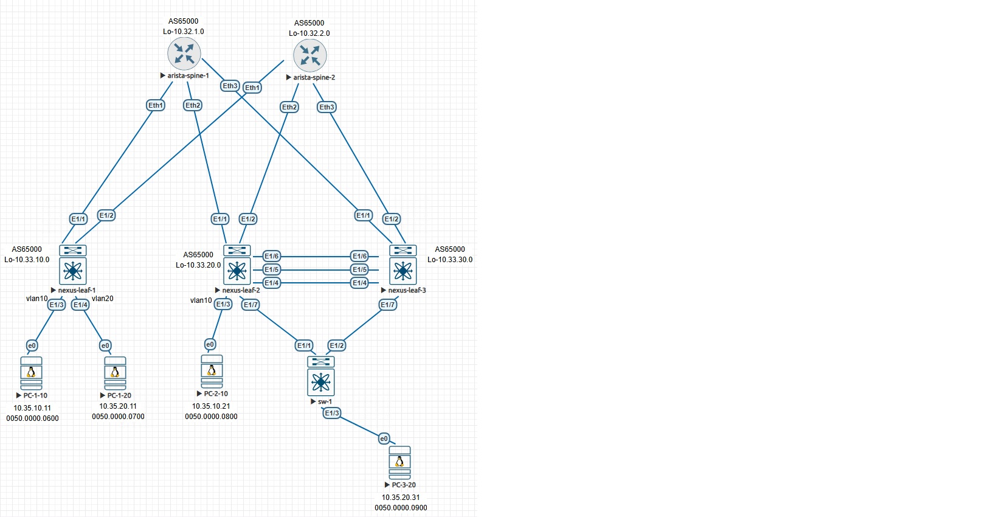

#         l3vpn evpn (ospf в качестве underlay)

## План работы
- берем готовую конфигурацию лифов и спайнов из предыдущей лабы по l3vpn
- делаем VPC между 2 и 3 лифом
- цепляем к 2 и 3 лифам свич sw-1, и клиента PC-3-20 к нему, как на картинке
- сначала эти два линка между лифами и sw-1 делаем без агрегирования, чтобы stp отработал - проверяем как работает при дергании линков
- потом агрегируем эти линки и смотрим еще раз

<p align="center">
 
</p>
конфиги спайнов и leaf-1 не меняются
## изменения конфига leaf-2:
```
feature lacp
feature vpc

vrf context vpc

vpc domain 100
  peer-switch
  role priority 200
  peer-keepalive destination 100.100.100.101 source 100.100.100.100 vrf vpc
  delay restore 300
  peer-gateway
  layer3 peer-router
  auto-recovery
  delay restore interface-vlan 300
  ip arp synchronize
  
interface Ethernet1/4
  switchport mode trunk
  channel-group 100 mode active

interface Ethernet1/5
  no switchport
  vrf member vpc
  ip address 100.100.100.100/31
  no shutdown

interface Ethernet1/6
  switchport mode trunk
  channel-group 100 mode active

interface Ethernet1/7
  switchport mode trunk

interface loopback0
  ip address 10.33.100.0/32 secondary
```

## изменения конфига leaf-3:
```
feature lacp
feature vpc

vrf context vpc

vpc domain 100
  peer-switch
  role priority 100
  peer-keepalive destination 100.100.100.100 source 100.100.100.101 vrf vpc
  delay restore 300
  peer-gateway
  layer3 peer-router
  auto-recovery
  delay restore interface-vlan 300
  ip arp synchronize
  
interface Ethernet1/4
  switchport mode trunk
  channel-group 100 mode active

interface Ethernet1/5
  no switchport
  vrf member vpc
  ip address 100.100.100.101/31
  no shutdown

interface Ethernet1/6
  switchport mode trunk
  channel-group 100 mode active

interface Ethernet1/7
  switchport mode trunk

interface loopback0
  ip address 10.33.100.0/32 secondary
```
   
## конфигурация arista-spine-2 (не изменилась)
```
interface Ethernet1
   no switchport
   ip address 10.34.2.10/31
   ip ospf network point-to-point
   ip ospf area 0.0.0.0
!
interface Ethernet2
   no switchport
   ip address 10.34.2.20/31
   ip ospf network point-to-point
   ip ospf area 0.0.0.0
!
interface Ethernet3
   no switchport
   ip address 10.34.2.30/31
   ip ospf network point-to-point
   ip ospf area 0.0.0.0
!
interface Loopback1
   ip address 10.32.2.0/32
   ip ospf area 0.0.0.0
!
ip routing
!
router bgp 65000
   router-id 10.32.2.0
   bgp listen range 10.33.0.0/16 peer-group LEAVES remote-as 65000
   neighbor LEAVES peer group
   neighbor LEAVES remote-as 65000
   neighbor LEAVES update-source Loopback1
   neighbor LEAVES bfd
   neighbor LEAVES route-reflector-client
   neighbor LEAVES send-community extended
   !
   address-family evpn
      neighbor LEAVES activate
!
router ospf 65000
   max-lsa 12000
```

## конфигурация nexus-leaf-1
```
hostname nexus-leaf-1
nv overlay evpn
feature ospf
feature bgp
feature fabric forwarding
feature interface-vlan
feature vn-segment-vlan-based
feature bfd
feature nv overlay

hardware access-list tcam region racl 512
hardware access-list tcam region arp-ether 256 double-wide

fabric forwarding anycast-gateway-mac 1234.5678.0100
vlan 1,10,20,1000
vlan 10
  vn-segment 10
vlan 20
  vn-segment 20
vlan 1000
  vn-segment 1000

vrf context CUST-1
  vni 1000
  rd auto
  address-family ipv4 unicast
    route-target both auto
    route-target both auto evpn
vrf context management

interface Vlan10
  no shutdown
  vrf member CUST-1
  ip address 10.35.10.1/24
  fabric forwarding mode anycast-gateway

interface Vlan20
  no shutdown
  vrf member CUST-1
  ip address 10.35.20.1/24
  fabric forwarding mode anycast-gateway

interface Vlan1000
  no shutdown
  vrf member CUST-1
  ip forward

interface nve1
  no shutdown
  host-reachability protocol bgp
  source-interface loopback0
  member vni 10
    suppress-arp
    ingress-replication protocol bgp
  member vni 20
    suppress-arp
    ingress-replication protocol bgp
  member vni 1000 associate-vrf

interface Ethernet1/1
  no switchport
  ip address 10.34.1.11/31
  ip ospf network point-to-point
  ip router ospf 65000 area 0.0.0.0
  no shutdown

interface Ethernet1/2
  no switchport
  ip address 10.34.2.11/31
  ip ospf network point-to-point
  ip router ospf 65000 area 0.0.0.0
  no shutdown
interface Ethernet1/3
  switchport access vlan 10
interface Ethernet1/4
  switchport access vlan 20
interface loopback0
  ip address 10.33.10.0/32
  ip router ospf 65000 area 0.0.0.0

router ospf 65000
router bgp 65000
  address-family l2vpn evpn
  template peer SPINES
    remote-as 65000
    update-source loopback0
    address-family l2vpn evpn
      send-community
      send-community extended
  neighbor 10.32.1.0
    inherit peer SPINES
  neighbor 10.32.2.0
    inherit peer SPINES
```

## конфигурация nexus-leaf-2
```
hostname nexus-leaf-2
nv overlay evpn
feature ospf
feature bgp
feature fabric forwarding
feature interface-vlan
feature vn-segment-vlan-based
feature bfd
feature nv overlay

hardware access-list tcam region racl 512
hardware access-list tcam region arp-ether 256 double-wide

fabric forwarding anycast-gateway-mac 1234.5678.0100
vlan 1,10,1000
vlan 10
  vn-segment 10
vlan 1000
  vn-segment 1000

vrf context CUST-1
  vni 1000
  rd auto
  address-family ipv4 unicast
    route-target both auto
    route-target both auto evpn
vrf context management

interface Vlan10
  no shutdown
  vrf member CUST-1
  ip address 10.35.10.1/24
  fabric forwarding mode anycast-gateway

interface Vlan1000
  no shutdown
  vrf member CUST-1
  ip forward

interface nve1
  no shutdown
  host-reachability protocol bgp
  source-interface loopback0
  member vni 10
    suppress-arp
    ingress-replication protocol bgp
  member vni 1000 associate-vrf


interface Ethernet1/1
  no switchport
  ip address 10.34.1.21/31
  ip ospf network point-to-point
  ip router ospf 65000 area 0.0.0.0
  no shutdown

interface Ethernet1/2
  no switchport
  ip address 10.34.2.21/31
  ip ospf network point-to-point
  ip router ospf 65000 area 0.0.0.0
  no shutdown
interface Ethernet1/3
  switchport access vlan 10
interface loopback0
  ip address 10.33.20.0/32
  ip router ospf 65000 area 0.0.0.0

router ospf 65000
router bgp 65000
  address-family l2vpn evpn
  template peer SPINES
    remote-as 65000
    update-source loopback0
    address-family l2vpn evpn
      send-community
      send-community extended
  neighbor 10.32.1.0
    inherit peer SPINES
  neighbor 10.32.2.0
    inherit peer SPINES
```

## конфигурация nexus-leaf-3
```
hostname nexus-leaf-3
nv overlay evpn
feature ospf
feature bgp
feature fabric forwarding
feature interface-vlan
feature vn-segment-vlan-based
feature bfd
feature nv overlay

hardware access-list tcam region racl 512
hardware access-list tcam region arp-ether 256 double-wide

fabric forwarding anycast-gateway-mac 1234.5678.0100
vlan 1,20,1000
vlan 20
  vn-segment 20
vlan 1000
  vn-segment 1000

vrf context CUST-1
  vni 1000
  rd auto
  address-family ipv4 unicast
    route-target both auto
    route-target both auto evpn
vrf context management

interface Vlan20
  no shutdown
  vrf member CUST-1
  ip address 10.35.20.1/24
  fabric forwarding mode anycast-gateway

interface Vlan1000
  no shutdown
  vrf member CUST-1
  ip forward

interface nve1
  no shutdown
  host-reachability protocol bgp
  source-interface loopback0
  member vni 20
    suppress-arp
    ingress-replication protocol bgp
  member vni 1000 associate-vrf

interface Ethernet1/1
  no switchport
  ip address 10.34.1.31/31
  ip ospf network point-to-point
  ip router ospf 65000 area 0.0.0.0
  no shutdown

interface Ethernet1/2
  no switchport
  ip address 10.34.2.31/31
  ip ospf network point-to-point
  ip router ospf 65000 area 0.0.0.0
  no shutdown

interface Ethernet1/3
  switchport access vlan 20
interface loopback0
  ip address 10.33.30.0/32
  ip router ospf 65000 area 0.0.0.0

router ospf 65000
router bgp 65000
  address-family l2vpn evpn
  template peer SPINES
    remote-as 65000
    update-source loopback0
    address-family l2vpn evpn
      send-community
      send-community extended
  neighbor 10.32.1.0
    inherit peer SPINES
  neighbor 10.32.2.0
    inherit peer SPINES
```
## проверяем разное
### пинги между машинами в разных комбинациях - разные vlan-ы на одном лифе, на разных лифах, один vlan на разных лифах
```
root@PC-1-10:/home/gns3# ping 10.35.20.11
PING 10.35.20.11 (10.35.20.11): 56 data bytes
64 bytes from 10.35.20.11: seq=0 ttl=63 time=1.760 ms
64 bytes from 10.35.20.11: seq=1 ttl=63 time=2.490 ms

root@PC-1-20:/home/gns3# ping 10.35.10.21
PING 10.35.10.21 (10.35.10.21): 56 data bytes
64 bytes from 10.35.10.21: seq=0 ttl=62 time=15.430 ms
64 bytes from 10.35.10.21: seq=1 ttl=62 time=7.460 ms

root@PC-2-10:/home/gns3# ping 10.35.10.11
PING 10.35.10.11 (10.35.10.11): 56 data bytes
64 bytes from 10.35.10.11: seq=0 ttl=64 time=8.472 ms
64 bytes from 10.35.10.11: seq=1 ttl=64 time=10.520 ms

root@PC-3-20:/home/gns3# ping 10.35.10.21
PING 10.35.10.21 (10.35.10.21): 56 data bytes
64 bytes from 10.35.10.21: seq=0 ttl=62 time=14.277 ms
64 bytes from 10.35.10.21: seq=1 ttl=62 time=7.294 ms
```
### смотрим таблицы роутов - видим что появились маршруты вида mac-ip и добавилась секция L3VNI
```
leaf-10# sh bgp l2vpn evpn vrf all 
   Network            Next Hop            Metric     LocPrf     Weight Path
Route Distinguisher: 10.33.10.0:32777    (L2VNI 10)
*>l[2]:[0]:[0]:[48]:[0050.0000.0600]:[0]:[0.0.0.0]/216
                      10.33.10.0                        100      32768 i
*>i[2]:[0]:[0]:[48]:[0050.0000.0800]:[0]:[0.0.0.0]/216
                      10.33.20.0                        100          0 i
*>l[2]:[0]:[0]:[48]:[0050.0000.0600]:[32]:[10.35.10.11]/272
                      10.33.10.0                        100      32768 i
*>i[2]:[0]:[0]:[48]:[0050.0000.0800]:[32]:[10.35.10.21]/272
                      10.33.20.0                        100          0 i
*>l[3]:[0]:[32]:[10.33.10.0]/88
                      10.33.10.0                        100      32768 i
*>i[3]:[0]:[32]:[10.33.20.0]/88
                      10.33.20.0                        100          0 i

Route Distinguisher: 10.33.10.0:32787    (L2VNI 20)
*>l[2]:[0]:[0]:[48]:[0050.0000.0700]:[0]:[0.0.0.0]/216
                      10.33.10.0                        100      32768 i
*>i[2]:[0]:[0]:[48]:[0050.0000.0900]:[0]:[0.0.0.0]/216
                      10.33.30.0                        100          0 i
*>l[2]:[0]:[0]:[48]:[0050.0000.0700]:[32]:[10.35.20.11]/272
                      10.33.10.0                        100      32768 i
*>i[2]:[0]:[0]:[48]:[0050.0000.0900]:[32]:[10.35.20.31]/272
                      10.33.30.0                        100          0 i
*>l[3]:[0]:[32]:[10.33.10.0]/88
                      10.33.10.0                        100      32768 i
*>i[3]:[0]:[32]:[10.33.30.0]/88
                      10.33.30.0                        100          0 i

Route Distinguisher: 10.33.20.0:32777
* i[2]:[0]:[0]:[48]:[0050.0000.0800]:[0]:[0.0.0.0]/216
                      10.33.20.0                        100          0 i
*>i                   10.33.20.0                        100          0 i
* i[2]:[0]:[0]:[48]:[0050.0000.0800]:[32]:[10.35.10.21]/272
                      10.33.20.0                        100          0 i
*>i                   10.33.20.0                        100          0 i
* i[3]:[0]:[32]:[10.33.20.0]/88
                      10.33.20.0                        100          0 i
*>i                   10.33.20.0                        100          0 i

Route Distinguisher: 10.33.30.0:32787
*>i[2]:[0]:[0]:[48]:[0050.0000.0900]:[0]:[0.0.0.0]/216
                      10.33.30.0                        100          0 i
* i                   10.33.30.0                        100          0 i
*>i[2]:[0]:[0]:[48]:[0050.0000.0900]:[32]:[10.35.20.31]/272
                      10.33.30.0                        100          0 i
* i                   10.33.30.0                        100          0 i
*>i[3]:[0]:[32]:[10.33.30.0]/88
                      10.33.30.0                        100          0 i
* i                   10.33.30.0                        100          0 i

Route Distinguisher: 10.33.10.0:3    (L3VNI 1000)
*>i[2]:[0]:[0]:[48]:[0050.0000.0800]:[32]:[10.35.10.21]/272
                      10.33.20.0                        100          0 i
*>i[2]:[0]:[0]:[48]:[0050.0000.0900]:[32]:[10.35.20.31]/272
                      10.33.30.0                        100          0 i
```
### также появилась табличка, которая раньше была пустой
```
leaf-10# sh l2route mac-ip all 
Topology    Mac Address    Host IP                                 Prod   Flags         Seq No     Next-Hops                              
----------- -------------- --------------------------------------- ------ ---------- ---------- ---------------------------------------
10          0050.0000.0600 10.35.10.11                             HMM    L,            0         Local                                  
10          0050.0000.0800 10.35.10.21                             BGP    --            0         10.33.20.0 (Label: 10)                 
20          0050.0000.0700 10.35.20.11                             HMM    L,            0         Local                                  
20          0050.0000.0900 10.35.20.31                             BGP    --            0         10.33.30.0 (Label: 20)   
```
### смотрим как работает suppress-arp
```
leaf-10# sh ip arp  suppression-cache local 
Ip Address      Age      Mac Address    Vlan Physical-ifindex    Flags
10.35.10.11     00:09:56 0050.0000.0600   10 Ethernet1/3         L
10.35.20.11     00:10:37 0050.0000.0700   20 Ethernet1/4         L

leaf-10# sh ip arp  suppression-cache remote 
Ip Address      Age      Mac Address    Vlan Physical-ifindex    Flags    Remote Vtep Addrs
10.35.10.21     01:23:52 0050.0000.0800   10 (null)              R        10.33.20.0  
10.35.20.31     01:23:46 0050.0000.0900   20 (null)              R        10.33.30.0
```

