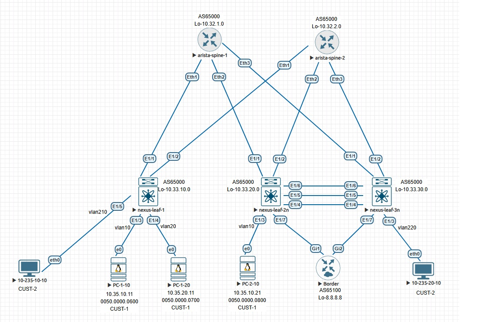

#         EVPN - маршрутизация между VRF через EVPN route-type 5

## План работы
- берем готовую конфигурацию лифов и спайнов из предыдущей лабы по multihoming-у
- создаем на всех лифах вторую VRF
- к бордер-лифам (leaf-2n и leaf-3n, которые в VPC) цепляем router-on-the-stick - asr1000v (Border), port-channel к VPC-паре
- от Border-1 делаем два point-to-point-а - один к бордер-лифам в одну VRF, второй в другую VRF
- создаем на бордер-лифах ipv4 address-family и строим на обоих point-to-point-ах eBGP ipv4 к Border-у
- на Border-е настраиваем на обоих eBGP-пирах as-override, чтобы Border передавал маршруты от одного пира (vrf CUST-1) другому (vrf CUST-2) с подменой as-path на свою AS, и наоборот
- проверяем что получилось

<p align="center">
 
</p>

<details><summary>
 
### конфиги спайнов не меняются

</summary>
 
```
spine-1#sh run
! Command: show running-config
! device: spine-1 (vEOS-lab, EOS-4.29.2F)
!
! boot system flash:/vEOS-lab.swi
!
no aaa root
!
transceiver qsfp default-mode 4x10G
!
service routing protocols model multi-agent
!
hostname spine-1
!
spanning-tree mode mstp
!
interface Ethernet1
   no switchport
   ip address 10.34.1.10/31
   ip ospf network point-to-point
   ip ospf area 0.0.0.0
!
interface Ethernet2
   no switchport
   ip address 10.34.1.20/31
   ip ospf network point-to-point
   ip ospf area 0.0.0.0
!
interface Ethernet3
   no switchport
   ip address 10.34.1.30/31
   ip ospf network point-to-point
   ip ospf area 0.0.0.0
!
interface Ethernet4
!
interface Ethernet5
!
interface Loopback1
   ip address 10.32.1.0/32
   ip ospf area 0.0.0.0
!
interface Management1
!
ip routing
!
peer-filter LEAVES-ASNs
   10 match as-range 65010-65030 result accept
!
router bgp 65000
   router-id 10.32.1.0
   bgp listen range 10.33.0.0/16 peer-group LEAVES remote-as 65000
   neighbor LEAVES peer group
   neighbor LEAVES remote-as 65000
   neighbor LEAVES update-source Loopback1
   neighbor LEAVES route-reflector-client
   neighbor LEAVES send-community extended
   !
   address-family evpn
      neighbor LEAVES activate
!
router ospf 65000
   max-lsa 12000
!
end

spine-2#sh run
! Command: show running-config
! device: spine-2 (vEOS-lab, EOS-4.29.2F)
!
! boot system flash:/vEOS-lab.swi
!
no aaa root
!
transceiver qsfp default-mode 4x10G
!
service routing protocols model multi-agent
!
hostname spine-2
!
spanning-tree mode mstp
!
interface Ethernet1
   no switchport
   ip address 10.34.2.10/31
   ip ospf network point-to-point
   ip ospf area 0.0.0.0
!
interface Ethernet2
   no switchport
   ip address 10.34.2.20/31
   ip ospf network point-to-point
   ip ospf area 0.0.0.0
!
interface Ethernet3
   no switchport
   ip address 10.34.2.30/31
   ip ospf network point-to-point
   ip ospf area 0.0.0.0
!
interface Ethernet4
!
interface Ethernet5
!
interface Loopback1
   ip address 10.32.2.0/32
   ip ospf area 0.0.0.0
!
interface Management1
!
ip routing
!
peer-filter LEAVES-ASNs
   10 match as-range 65010-65030 result accept
!
router bgp 65000
   router-id 10.32.2.0
   bgp listen range 10.33.0.0/16 peer-group LEAVES remote-as 65000
   neighbor LEAVES peer group
   neighbor LEAVES remote-as 65000
   neighbor LEAVES update-source Loopback1
   neighbor LEAVES route-reflector-client
   neighbor LEAVES send-community extended
   !
   address-family evpn
      neighbor LEAVES activate
!
router ospf 65000
   max-lsa 12000
!
end
```

</details>

<details><summary>
 
### конфиг leaf-1

</summary>
 
```
leaf-10# sh run
hostname leaf-10

nv overlay evpn
feature ospf
feature bgp
feature fabric forwarding
feature interface-vlan
feature vn-segment-vlan-based
feature lldp
feature bfd
feature nv overlay

hardware access-list tcam region racl 512
hardware access-list tcam region arp-ether 256 double-wide

fabric forwarding anycast-gateway-mac 1234.5678.0100
vlan 1,10,20,1000,210,220,2000
vlan 10
  vn-segment 10
vlan 20
  vn-segment 20
vlan 210
  vn-segment 210
vlan 220
  vn-segment 220
vlan 1000
  vn-segment 1000
vlan 2000
  vn-segment 2000

vrf context CUST-1
  vni 1000
  rd auto
  address-family ipv4 unicast
    route-target both auto
    route-target both auto evpn
vrf context CUST-2
  vni 2000
  rd auto
  address-family ipv4 unicast
    route-target both auto
    route-target both auto evpn
vrf context management
hardware access-list tcam region racl 512
hardware access-list tcam region arp-ether 256 double-wide

interface Vlan10
  no shutdown
  vrf member CUST-1
  ip address 10.35.10.1/24
  fabric forwarding mode anycast-gateway

interface Vlan20
  no shutdown
  vrf member CUST-1
  ip address 10.35.20.1/24
  fabric forwarding mode anycast-gateway

interface Vlan210
  no shutdown
  vrf member CUST-2
  ip address 10.235.10.1/24
  fabric forwarding mode anycast-gateway

interface Vlan220
  no shutdown
  vrf member CUST-2
  ip address 10.235.20.1/24
  fabric forwarding mode anycast-gateway

interface Vlan1000
  no shutdown
  vrf member CUST-1
  ip forward

interface Vlan2000
  no shutdown
  vrf member CUST-2
  ip forward

interface nve1
  no shutdown
  host-reachability protocol bgp
  source-interface loopback0
  member vni 10
    suppress-arp
    ingress-replication protocol bgp
  member vni 20
    suppress-arp
    ingress-replication protocol bgp
  member vni 210
    suppress-arp
    ingress-replication protocol bgp
  member vni 220
    suppress-arp
    ingress-replication protocol bgp
  member vni 1000 associate-vrf
  member vni 2000 associate-vrf

interface Ethernet1/1
  no switchport
  ip address 10.34.1.11/31
  ip ospf network point-to-point
  ip router ospf 65000 area 0.0.0.0
  no shutdown

interface Ethernet1/2
  no switchport
  ip address 10.34.2.11/31
  ip ospf network point-to-point
  ip router ospf 65000 area 0.0.0.0
  no shutdown

interface Ethernet1/3
  switchport access vlan 10

interface Ethernet1/4
  switchport access vlan 20

interface Ethernet1/5
  switchport access vlan 210

interface loopback0
  ip address 10.33.10.0/32
  ip router ospf 65000 area 0.0.0.0
icam monitor scale

router ospf 65000
router bgp 65000
  address-family l2vpn evpn
  template peer SPINES
    remote-as 65000
    update-source loopback0
    address-family l2vpn evpn
      send-community
      send-community extended
  neighbor 10.32.1.0
    inherit peer SPINES
  neighbor 10.32.2.0
    inherit peer SPINES
```

</details>

<details><summary>
 
### конфиг leaf-2n

</summary>
 
```
leaf-20n# sh run
hostname leaf-2n
nv overlay evpn
feature ospf
feature bgp
feature fabric forwarding
feature interface-vlan
feature vn-segment-vlan-based
feature lacp
feature vpc
feature lldp
feature bfd
feature nv overlay

hardware access-list tcam region racl 512
hardware access-list tcam region arp-ether 256 double-wide

fabric forwarding anycast-gateway-mac 1234.5678.0100
vlan 1,10,20,210,220,500,600,1000,2000
vlan 10
  vn-segment 10
vlan 20
  vn-segment 20
vlan 210
  vn-segment 210
vlan 220
  vn-segment 220
vlan 1000
  vn-segment 1000
vlan 2000
  vn-segment 2000

route-map c-to-bgp permit 10
vrf context CUST-1
  vni 1000
  rd auto
  address-family ipv4 unicast
    route-target both auto
    route-target both auto evpn
vrf context CUST-2
  vni 2000
  rd auto
  address-family ipv4 unicast
    route-target both auto
    route-target both auto evpn
vrf context management
vrf context vpc
vpc domain 100
  peer-switch
  role priority 200
  peer-keepalive destination 100.100.100.101 source 100.100.100.100 vrf vpc
  delay restore 300
  peer-gateway
  layer3 peer-router
  auto-recovery
  delay restore interface-vlan 300
  ip arp synchronize


interface Vlan1
  no ip redirects
  no ipv6 redirects

interface Vlan10
  no shutdown
  vrf member CUST-1
  no ip redirects
  ip address 10.35.10.1/24
  no ipv6 redirects
  fabric forwarding mode anycast-gateway

interface Vlan20
  no shutdown
  vrf member CUST-1
  no ip redirects
  ip address 10.35.20.1/24
  no ipv6 redirects
  fabric forwarding mode anycast-gateway

interface Vlan210
  no shutdown
  vrf member CUST-2
  no ip redirects
  ip address 10.235.10.1/24
  no ipv6 redirects
  fabric forwarding mode anycast-gateway

interface Vlan220
  no shutdown
  vrf member CUST-2
  no ip redirects
  ip address 10.235.20.1/24
  no ipv6 redirects
  fabric forwarding mode anycast-gateway

interface Vlan500
  no shutdown
  vrf member CUST-1
  no ip redirects
  ip address 200.0.0.1/29
  no ipv6 redirects

interface Vlan600
  no shutdown
  vrf member CUST-2
  no ip redirects
  ip address 220.0.0.1/29
  no ipv6 redirects

interface Vlan1000
  no shutdown
  vrf member CUST-1
  no ip redirects
  ip forward
  no ipv6 redirects

interface Vlan2000
  no shutdown
  vrf member CUST-2
  no ip redirects
  ip forward
  no ipv6 redirects

interface port-channel10
  switchport mode trunk
  vpc 10

interface port-channel100
  switchport mode trunk
  spanning-tree port type network
  vpc peer-link

interface nve1
  no shutdown
  host-reachability protocol bgp
  advertise virtual-rmac
  source-interface loopback0
  member vni 10
    suppress-arp
    ingress-replication protocol bgp
  member vni 20
    suppress-arp
    ingress-replication protocol bgp
  member vni 210
    suppress-arp
    ingress-replication protocol bgp
  member vni 220
    suppress-arp
    ingress-replication protocol bgp
  member vni 1000 associate-vrf
  member vni 2000 associate-vrf

interface Ethernet1/1
  no switchport
  ip address 10.34.1.21/31
  ip ospf network point-to-point
  ip router ospf 65000 area 0.0.0.0
  no shutdown

interface Ethernet1/2
  no switchport
  ip address 10.34.2.21/31
  ip ospf network point-to-point
  ip router ospf 65000 area 0.0.0.0
  no shutdown

interface Ethernet1/3
  switchport access vlan 10

interface Ethernet1/4
  switchport mode trunk
  channel-group 100 mode active

interface Ethernet1/5
  no switchport
  vrf member vpc
  ip address 100.100.100.100/31
  no shutdown

interface Ethernet1/6
  switchport mode trunk
  channel-group 100 mode active

interface Ethernet1/7
  switchport mode trunk
  channel-group 10 mode active

interface loopback0
  ip address 10.33.20.0/32
  ip address 10.33.100.0/32 secondary
  ip router ospf 65000 area 0.0.0.0

router ospf 65000
router bgp 65000
  address-family l2vpn evpn
    advertise-pip
  template peer SPINES
    remote-as 65000
    update-source loopback0
    address-family l2vpn evpn
      send-community
      send-community extended
  neighbor 10.32.1.0
    inherit peer SPINES
  neighbor 10.32.2.0
    inherit peer SPINES
  vrf CUST-1
    neighbor 200.0.0.3
      remote-as 65100
      address-family ipv4 unicast
        send-community
        send-community extended
  vrf CUST-2
    neighbor 220.0.0.3
      remote-as 65100
      address-family ipv4 unicast
        send-community
        send-community extended
```

</details>

<details><summary>
 
### конфиг leaf-3n

</summary>
 
```
leaf-3n# sh run
hostname leaf-3n
nv overlay evpn
feature ospf
feature bgp
feature fabric forwarding
feature interface-vlan
feature vn-segment-vlan-based
feature lacp
feature vpc
feature lldp
feature bfd
feature nv overlay

hardware access-list tcam region racl 512
hardware access-list tcam region arp-ether 256 double-wide

fabric forwarding anycast-gateway-mac 1234.5678.0100
vlan 1,10,20,210,220,500,600,1000,2000
vlan 10
  vn-segment 10
vlan 20
  vn-segment 20
vlan 210
  vn-segment 210
vlan 220
  vn-segment 220
vlan 1000
  vn-segment 1000
vlan 2000
  vn-segment 2000

route-map c-to-bgp permit 10
vrf context CUST-1
  vni 1000
  rd auto
  address-family ipv4 unicast
    route-target both auto
    route-target both auto evpn
vrf context CUST-2
  vni 2000
  rd auto
  address-family ipv4 unicast
    route-target both auto
    route-target both auto evpn
vrf context management
vrf context vpc
vpc domain 100
  peer-switch
  role priority 100
  peer-keepalive destination 100.100.100.100 source 100.100.100.101 vrf vpc
  delay restore 300
  peer-gateway
  layer3 peer-router
  auto-recovery
  delay restore interface-vlan 300
  ip arp synchronize

interface Vlan1
  no ip redirects
  no ipv6 redirects

interface Vlan10
  no shutdown
  vrf member CUST-1
  no ip redirects
  ip address 10.35.10.1/24
  no ipv6 redirects
  fabric forwarding mode anycast-gateway

interface Vlan20
  no shutdown
  vrf member CUST-1
  no ip redirects
  ip address 10.35.20.1/24
  no ipv6 redirects
  fabric forwarding mode anycast-gateway

interface Vlan210
  no shutdown
  vrf member CUST-2
  no ip redirects
  ip address 10.235.10.1/24
  no ipv6 redirects
  fabric forwarding mode anycast-gateway

interface Vlan220
  no shutdown
  vrf member CUST-2
  no ip redirects
  ip address 10.235.20.1/24
  no ipv6 redirects
  fabric forwarding mode anycast-gateway

interface Vlan500
  no shutdown
  vrf member CUST-1
  no ip redirects
  ip address 200.0.0.2/29
  no ipv6 redirects

interface Vlan600
  no shutdown
  vrf member CUST-2
  no ip redirects
  ip address 220.0.0.2/29
  no ipv6 redirects

interface Vlan1000
  no shutdown
  vrf member CUST-1
  no ip redirects
  ip forward
  no ipv6 redirects

interface Vlan2000
  no shutdown
  vrf member CUST-2
  no ip redirects
  ip forward
  no ipv6 redirects

interface port-channel10
  switchport mode trunk
  vpc 10

interface port-channel100
  switchport mode trunk
  spanning-tree port type network
  vpc peer-link

interface nve1
  no shutdown
  host-reachability protocol bgp
  advertise virtual-rmac
  source-interface loopback0
  member vni 10
    suppress-arp
    ingress-replication protocol bgp
  member vni 20
    suppress-arp
    ingress-replication protocol bgp
  member vni 210
    suppress-arp
    ingress-replication protocol bgp
  member vni 220
    suppress-arp
    ingress-replication protocol bgp
  member vni 1000 associate-vrf
  member vni 2000 associate-vrf

interface Ethernet1/1
  no switchport
  ip address 10.34.1.31/31
  ip ospf network point-to-point
  ip router ospf 65000 area 0.0.0.0
  no shutdown

interface Ethernet1/2
  no switchport
  ip address 10.34.2.31/31
  ip ospf network point-to-point
  ip router ospf 65000 area 0.0.0.0
  no shutdown

interface Ethernet1/3
  switchport access vlan 220

interface Ethernet1/4
  switchport mode trunk
  channel-group 100 mode active

interface Ethernet1/5
  no switchport
  vrf member vpc
  ip address 100.100.100.101/31
  no shutdown

interface Ethernet1/6
  switchport mode trunk
  channel-group 100 mode active

interface Ethernet1/7
  switchport mode trunk
  channel-group 10 mode active

interface loopback0
  ip address 10.33.30.0/32
  ip address 10.33.100.0/32 secondary
  ip router ospf 65000 area 0.0.0.0

router ospf 65000
router bgp 65000
  address-family l2vpn evpn
    advertise-pip
  template peer SPINES
    remote-as 65000
    update-source loopback0
    address-family l2vpn evpn
      send-community
      send-community extended
  neighbor 10.32.1.0
    inherit peer SPINES
  neighbor 10.32.2.0
    inherit peer SPINES
  vrf CUST-1
    neighbor 200.0.0.3
      remote-as 65100
      address-family ipv4 unicast
        send-community
        send-community extended
        soft-reconfiguration inbound always
  vrf CUST-2
    neighbor 220.0.0.3
      remote-as 65100
      address-family ipv4 unicast
        send-community
        send-community extended
        soft-reconfiguration inbound always
```

</details>

<details><summary>
 
### конфиг Border

</summary>
 
```
Border-1#sh run
hostname Border-1

interface Loopback8
 ip address 8.8.8.8 255.255.255.255
!
interface Port-channel1
 no ip address
 no negotiation auto
 no mop enabled
 no mop sysid
!
interface Port-channel1.500
 encapsulation dot1Q 500
 ip address 200.0.0.3 255.255.255.248
!
interface Port-channel1.600
 encapsulation dot1Q 600
 ip address 220.0.0.3 255.255.255.248
!
interface GigabitEthernet1
 no ip address
 negotiation auto
 no mop enabled
 no mop sysid
 channel-group 1 mode active
!
interface GigabitEthernet2
 no ip address
 negotiation auto
 no mop enabled
 no mop sysid
 channel-group 1 mode active
!
router bgp 65100
 bgp log-neighbor-changes
 neighbor 200.0.0.1 remote-as 65000
 neighbor 200.0.0.2 remote-as 65000
 neighbor 220.0.0.1 remote-as 65000
 neighbor 220.0.0.2 remote-as 65000
 !
 address-family ipv4
  network 8.8.8.8 mask 255.255.255.255
  neighbor 200.0.0.1 activate
  neighbor 200.0.0.1 as-override
  neighbor 200.0.0.2 activate
  neighbor 200.0.0.2 as-override
  neighbor 220.0.0.1 activate
  neighbor 220.0.0.1 as-override
  neighbor 220.0.0.2 activate
  neighbor 220.0.0.2 as-override
 exit-address-family
end
```

</details>

## рассуждения о том что получилось и вопросы
Конечно же, все ip-роуты, которые прилетают на Border от leaf-2/3 из vrf CUST-1, он успешно передает им же обратно, но уже в vrf CUST-2, и наоборот. Конечно же, эти ip-роуты разлетаются дальше средствами bgp evpn по всей остальной фабрике в виде type-5

Наверняка это рассказывалось на лекциях, а я просто пропустил( - подскажите пожалуйста, к правильным ли выводам я пришел?
1. На бордер-лифах 2 и 3 мы создаем ip-соседство к бродер-роутеру и

### устройство сразу, без дополнительных настроек,  все роуты, которые прилетели в него в af evpn (из остальной фабрики) ,начинает транслировать/редистрибутить в af ipv4, и раздавать соответственно в сторону ip-нейборов. И наоборот (в виде type-5)
вот например на leaf-2 (мы не говорили пока никаких редистрибьютов вообще):
leaf-20n# sh ip route vrf C
CUST-1   CUST-2   
leaf-20n# sh ip route vrf CUST-1
IP Route Table for VRF "CUST-1"

8.8.8.8/32, ubest/mbest: 1/0

    *via 200.0.0.3, [20/0], 3d06h, bgp-65000, external, tag 65100
    
10.35.10.0/24, ubest/mbest: 1/0, attached

    *via 10.35.10.1, Vlan10, [0/0], 6d19h, direct
    
10.35.10.1/32, ubest/mbest: 1/0, attached

    *via 10.35.10.1, Vlan10, [0/0], 6d19h, local
    
### 10.35.10.11/32, ubest/mbest: 1/0
###    *via 10.33.10.0%default, [200/0], 3d06h, bgp-65000, internal, tag 65000, segid: 1000 tunnelid: 0xa210a00 encap: VXLAN
 
10.35.10.21/32, ubest/mbest: 1/0, attached
    *via 10.35.10.21, Vlan10, [190/0], 02:27:28, hmm
10.35.20.0/24, ubest/mbest: 1/0, attached
    *via 10.35.20.1, Vlan20, [0/0], 6d19h, direct
10.35.20.1/32, ubest/mbest: 1/0, attached
    *via 10.35.20.1, Vlan20, [0/0], 6d19h, local
### 10.35.20.11/32, ubest/mbest: 1/0
###    *via 10.33.10.0%default, [200/0], 3d06h, bgp-65000, internal, tag 65000, segid: 1000 tunnelid: 0xa210a00 encap: VXLAN
 
10.235.10.10/32, ubest/mbest: 1/0
    *via 200.0.0.3, [20/0], 3d06h, bgp-65000, external, tag 65100
200.0.0.0/29, ubest/mbest: 1/0, attached
    *via 200.0.0.1, Vlan500, [0/0], 6d19h, direct
200.0.0.1/32, ubest/mbest: 1/0, attached
    *via 200.0.0.1, Vlan500, [0/0], 6d19h, local
